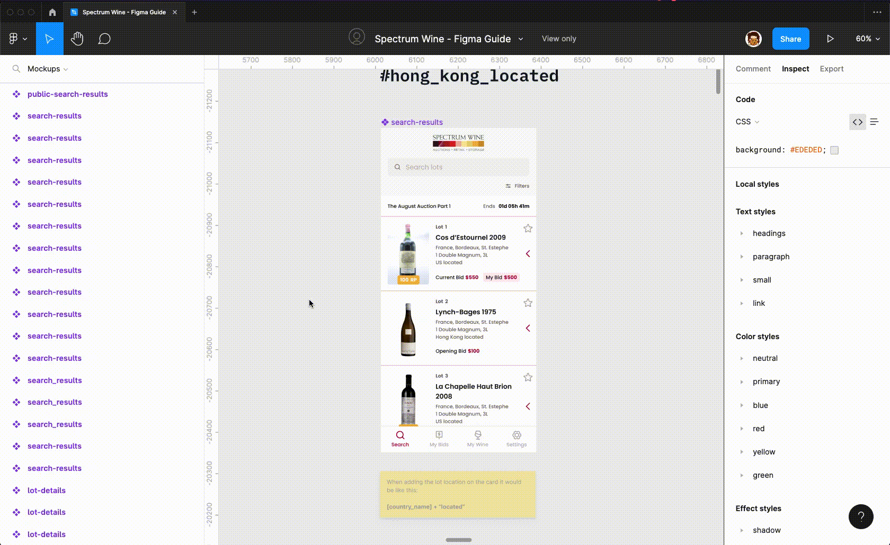

# ¿Cómo seleccionar una capa específica en el mapa?

### 1. Seleccionar vista requerida.

En el panel izquierdo debe resaltar el nombre de la vista seleccionada.

### 2. En el panel izquierdo, desplegar capas de la vista.

Al pasar el cursor sobre la vista en el panel izquierdo, resalta una flecha apuntando hacia abajo. Dar clic en ella para desplegar más capas.

Repetir este proceso hasta llegar al nivel de capas deseado.

### 3. Seleccionar capa

Cuando se llegue al nivel deseado, seleccionar la capa que se busca

