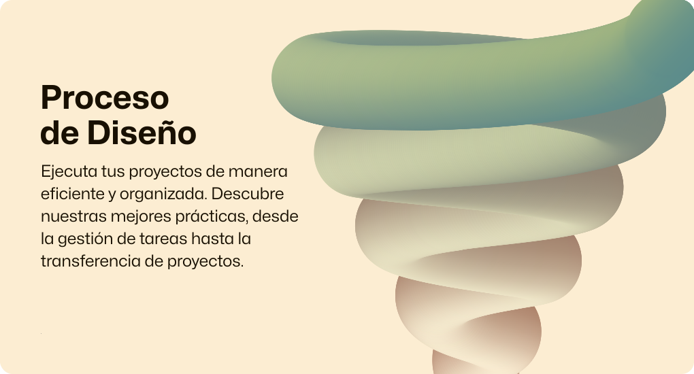

# Explora la base de conocimiento del equipo de UX

Aquí encontrarás todo lo que necesitas para conocer y ayudarnos a mejorar nuestros procesos y guías de diseño de experiencias de usuario. Desde la gestión de tareas hasta la transferencia de proyectos, aquí encontrarás las mejores prácticas y soluciones que utilizamos en cada etapa del proceso. ¡Explora nuestra guía y mejora tus proyectos de UX hoy!

---

  
  

