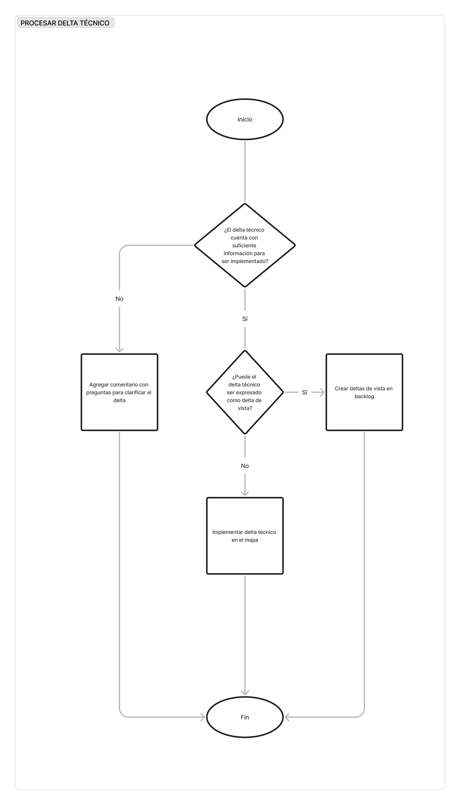

# Procesar delta técnico

**Propósito**

Implementar en el mapa un cambio masivo sobre las vistas.

**Pasos**

1.  **[Design Lead]** Analizar si el delta técnico cuenta con información suficiente para ser implementado. En caso contrario agregar **preguntas** para clarificar el delta, pasar a estado 1_1 y desasignarse.
    
2.  **[Design Lead]** Analizar si el delta técnico puede ser expresado como delta de vista. Si esto es viable, crear **deltas de vista** en backlog en estado 1_1, pasar **delta técnico** a estado 3_3 y desasignarse. En caso contrario, implementar **delta técnico** en **mapa**, pasar a estado 1_3 y desasignarse.
    

**Artefactos de entrada**

-   Delta técnico asignado al **Design Lead**.
    

**Artefactos de salida**

-   Preguntas para clarificar el delta.
    
-   Delta de vista en backlog.
    
-   Delta técnico actualizado.
    
-   Mapa actualizado.
    

**Diagrama de flujo**

